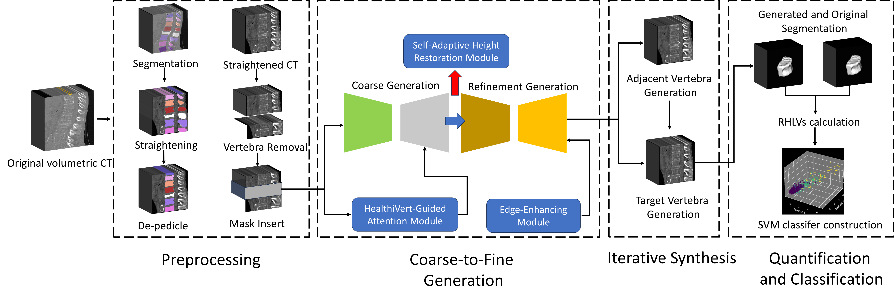
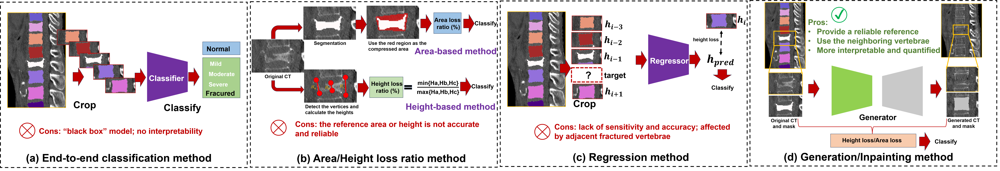
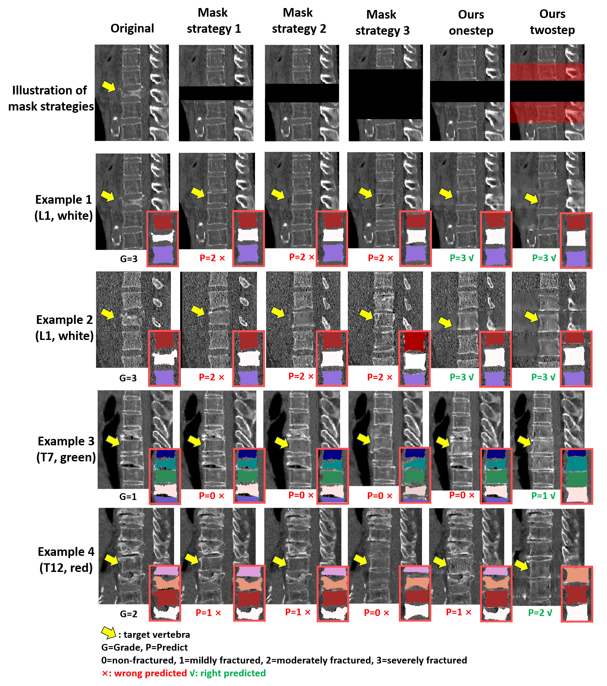
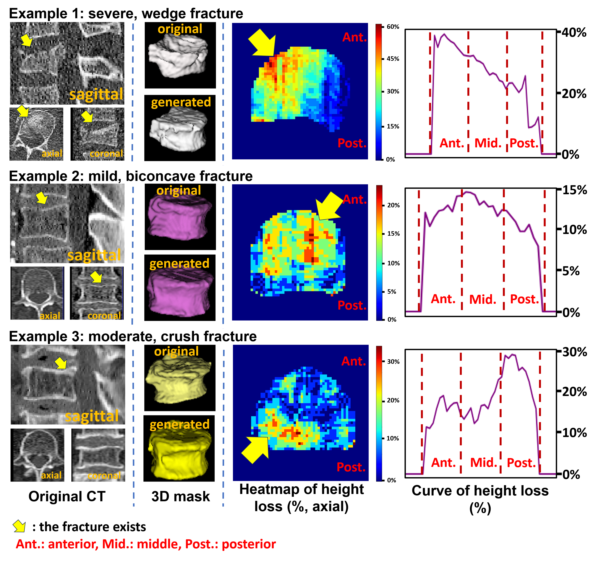

# HealthiVert-GAN: Pseudo-Healthy Vertebral Image Synthesis for Interpretable Compression Fracture Grading

[](LICENSE)

**HealthiVert-GAN** is a novel framework for synthesizing pseudo-healthy vertebral CT images from fractured vertebrae. By simulating pre-fracture states, it enables interpretable quantification of vertebral compression fractures (VCFs) through **Relative Height Loss of Vertebrae (RHLV)**. The model integrates a two-stage GAN architecture with anatomical consistency modules, achieving state-of-the-art performance on both public and private datasets.

---

## 🚀 Key Features
- **Two-Stage Synthesis**: Coarse-to-fine generation with 2.5D sagittal/coronal fusion.
- **Anatomic Modules**:
  - **Edge-Enhancing Module (EEM)**: Captures precise vertebral morphology.
  - **Self-adaptive Height Restoration Module (SHRM)**: Predicts healthy vertebral height adaptively.
  - **HealthiVert-Guided Attention Module (HGAM)**: Focuses on non-fractured regions via Grad-CAM++.
- **Iterative Synthesis**: Generates adjacent vertebrae first to minimize fracture interference.
- **RHLV Quantification**: Measures height loss in anterior/middle/posterior regions for SVM-based Genant grading.

---

## 🛠️ Architecture



### Workflow
1. **Preprocessing**: 
   - **Spine Straightening**: Align vertebrae vertically using SCNet segmentation.
   - **De-pedicle**: Remove vertebral arches for body-focused analysis.
   - **Masking**: Replace target vertebra with a fixed-height mask (40mm).
   
2. **Two-Stage Generation**:
   - **Coarse Generator**: Outputs initial CT and segments adjacent vertebrae.
   - **Refinement Generator**: Enhances details with contextual attention and edge loss.

3. **Iterative Synthesis**:
   - Step 1: Synthesize adjacent vertebrae.
   - Step 2: Generate target vertebra using Step 1 results.

4. **RHLV Calculation**:
   ```math
   RHLV = \frac{H_{syn} - H_{ori}}{H_{syn}}
   ```
   Segments vertebra into anterior/middle/posterior regions for detailed analysis.

   **SVM Classification**: Uses RHLV values to classify fractures into mild/moderate/severe.

### 🔑 Key Contributions

1. **Interpretable Quantification Beyond Black-Box Models**  
   Traditional end-to-end fracture classification models suffer from class imbalance and lack interpretability. HealthiVert-GAN addresses these by synthesizing pseudo-healthy vertebrae and quantifying height loss (RHLV) between generated and original vertebrae. This approach achieves superior performance (e.g., **72.3% Macro-F1** on Verse2019) while providing transparent metrics for clinical decisions.

2. **Height Loss Distribution Mapping for Surgical Planning**  
   HealthiVert-GAN generates cross-sectional height loss heatmaps that visualize compression patterns (wedge/biconcave/crush fractures). Clinicians can use these maps to assess fracture stability and plan interventions (e.g., vertebroplasty) with precision unmatched by single-slice methods.

3. **Anatomic Prior Integration**  
   Unlike conventional inpainting models, HealthiVert-GAN introduces adjacent vertebrae height variations as prior knowledge. The **Self-adaptive Height Restoration Module (SHRM)** dynamically adjusts generated vertebral heights based on neighboring healthy vertebrae, improving both interpretability and anatomic consistency.


---

## 🚀 Quick Start

### Installation

```bash
git clone https://github.com/zhibaishouheilab/HealthiVert-GAN.git
cd HealthiVert-GAN
pip install -r requirements.txt  # PyTorch, NiBabel, SimpleITK, OpenCV
```

### Data Preparation

#### Dataset Structure
Organize data as:

```
/dataset/
  ├── raw
      ├── 0001/
      │   ├── 0001.nii.gz    # Original CT
      │   └── 0001_msk.nii.gz   # Vertebrae segmentation
      └── 0002/
          ├── 0002.nii.gz
          └── 0002_msk.nii.gz
```
**Note**: You have to segment the vertebra firstly. Refer to [CTSpine1K-nnUNet](https://github.com/MIRACLE-Center/CTSpine1K) to obtain how to segment using nnU-Net.

#### Preprocessing

**Spine Straightening**:

```bash
python straighten/location_json_local.py  # Generate vertebral centroids
python straighten/straighten_mask_3d.py   # Output: ./dataset/straightened/
```

**Attention Map Generation**:

```bash
python Attention/grad_CAM_3d_sagittal.py  # Output: ./Attention/heatmap/
```

### Training

**Configure JSON**:

Update `vertebra_data.json` with patient IDs, labels, and paths.

**Train Model**:

```bash
python train.py \
  --dataroot ./dataset/straightened \
  --name HealthiVert_experiment \
  --model pix2pix \
  --direction BtoA \
  --batch_size 16 \
  --n_epochs 1000
```

Checkpoints saved in `./checkpoints/HealthiVert_experiment`.
The pretrained weights will be released later.

### Inference

**Generate Pseudo-Healthy Vertebrae**:

```bash
python eval_3d_sagittal_twostage.py # define the parameters in the code file
```

Outputs: `./output/CT_fake/` and `./output/label_fake/`.

**Fracture Grading**

**Calculate RHLV**:

```bash
python evaluation/RHLV_quantification.py 
```

**Train SVM Classifier**:

```bash
python evaluation/SVM_grading.py
```

**Evaluate generation results**:
```bash
python evaluation/generation_eval_sagittal.py
```
---

## 📊 Results

### Qualitative Comparison
The generation visulization of different masking strategies.


The visulization heatmap of vertebral height loss distribution in axial view, and the curve of height loss.


### Quantitative Performance (Verse2019 Dataset)

| Metric      | HealthiVert-GAN |   AOT-GAN |3D SupCon-SENet|
|-------------|-----------------|--------------|------------------|
| Macro-P     | 0.727           | 0.710        | 0.710            |
| Macro-R     | 0.753           | 0.707        | 0.636            |
| Macro-F1    | 0.723           | 0.692        | 0.667            |

Comparison model codes:
[AOT-GAN](https://github.com/researchmm/AOT-GAN-for-Inpainting)
[3D SupCon-SENet](https://github.com/wxwxwwxxx/VertebralFractureGrading)

---

## 📜 Citation

```bibtex
@misc{zhang2025healthivertgannovelframeworkpseudohealthy,
      title={HealthiVert-GAN: A Novel Framework of Pseudo-Healthy Vertebral Image Synthesis for Interpretable Compression Fracture Grading}, 
      author={Qi Zhang and Shunan Zhang and Ziqi Zhao and Kun Wang and Jun Xu and Jianqi Sun},
      year={2025},
      eprint={2503.05990},
      archivePrefix={arXiv},
      primaryClass={eess.IV},
      url={https://arxiv.org/abs/2503.05990}, 
}
```

## 📧 Contact
If you have any questions about the codes or paper, please let us know via [zhi-bai-shou-hei@sjtu.edu.cn](zhi-bai-shou-hei@sjtu.edu.cn).

---

## 🙇‍ Acknowledgment
- Thank Febian's [nnUnet](https://github.com/MIC-DKFZ/nnUNet).
- Thank Deng's shared dataset [CTSpine 1K](https://github.com/MIRACLE-Center/CTSpine1K?tab=readme-ov-file) and their pretrained nnUNet's weights.
- Thank [NeuroML](https://github.com/neuro-ml/straighten) that released the spine straightening algorithm.

## 📄 License

This project is licensed under the MIT License. See [LICENSE](LICENSE) for details.
