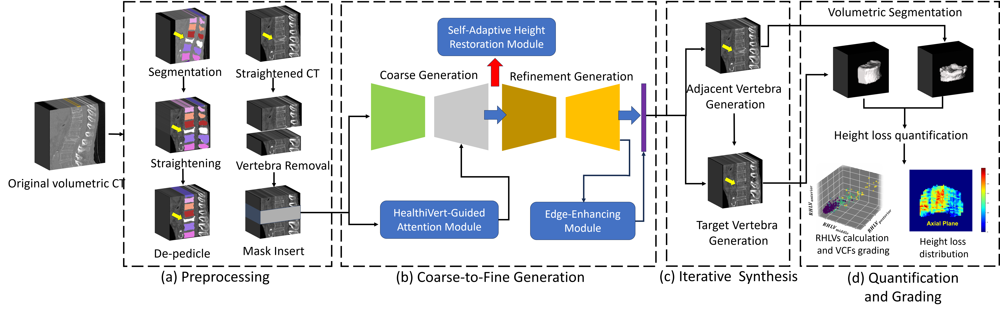

# HealthiVert-GAN
HealthiVert-GAN, a novel deep-learning framework designed to generate pseudo-healthy vertebral images. These images simulate the pre-fractured state of vertebrae, offering a potential improvement in diagnosis. The HealthiVert-GAN utilizes a coarse to fine, 2.5D synthesis network based on generative adversarial networks (GAN). 
# Workflow
Our overall workflow is divided into 4 steps: 
1. Vertebral Preprocessing
2. Two-Stage 2.5D Vertebral Generation
3. Iterative Vertebral Generation
4. RHLV Calculation and Fracture Grading

This project emphasizes the second and third steps, to obtain a pesudo-healthy vertebra in place of the original fractured one. We have designed a two-stage GAN, named HealthiVert-GAN, to inpaint the masked vertebral CT images. We consider the useful infomation of the adjacent vertebrae and the detrimental impact of adjacent fractures, so three innovative auxiliary modules are added: 
1. Edge-enhancing Module: provides a clearer representation of vertebral morphology.
2. Self-adaptive Height Restoration Module: help the synthesis vertebra restore to its predicted healthy height in a self-adaptive way.

3. HealthiVert-Guided Attention Module: improves the model’s ability to recognize non-fractured vertebrae and reduce focus on fractured areas.

And our generation consists of a two-stage generator and an interative synthesis:
1. Two-Stage 2.5D Vertebral Generation: consists of a coarse generator and a refinement generator, and we construct two networks to generate sagittal and coronal plane images of vertebrae, respectively. These images are fused to build up the 3D volumetric images.
2. Iterative Vertebral Generation: We first generate the adjacent vertebrae, then generate the target one, to enhance the reliability of generated vertebral images.

# How To Run Our Code
## Prepare your dataset
### File architecture
Our input images are vertebral CT images and their file format is .nii.gz. Each patient corresponds to a single folder, which consists of a CT image and a segmentation mapping. The file name is consistent of folder name. All folders are numbered and placed in the folder **/dataset/**.
### Preprocessing
Our preprocessing consists of two steps: straightening and de-pedicle. Firstly, you have to obtain location json file for each image. The json contains each vertebral centroid location in the images. Please run the **/straighten/location_json_local.py**. Secondly, vertebrae in the spine need to be straightened/aligned to a straight vertical line. And pedicle is removed in the segmentation. Please run the **/straighten/straighten_mask_3d.py** to obtain a **/dataset/straightened/** folder, which consists of **/CT** and **/label** folder, in which each vertebra is split seperately.

### Attention mapping
In our HealthiVert-Guided Attention Module, attention mapping is obtained from our pretrainde bianry classifier. Here we employ a 2D SENet as our classification network and train it using the train set. To simplify the use of the module, we provide the trained model's parameters and the network. Please run the **/Attention/grad_CAM_3d_sagittal.py** to obtain the attention mapping for each images, storing in folder **/heatmap**, which is needed in the HealthiVert-GAN training. 

### Train HealthiVert-GAN
Before run the train code, a json file containing all labels is needed. We provide a template **vertebra_data.json**. Each item corresponds the dataset split, patient id, vertebra id, and the label. You also need to indicate the Ateention mapping folder path and json file path in the **/data/aligned_dataset.py**. After that, run the **train.py** to train the GAN model. 
    python3 train.py --dataroot ./datasets/straighten/  --name test --model pix2pix --direction BtoA

### Evaluate 
After training, we evaluate it and generate images using the trained parameters. For sagittal synthesis, we perform the iterative vertebral generation by running **eval_3d_sagittal_twostage.py**. The synthesized images will be stored in the **/output/your_dataset/**, which contains two folders: **/CT_fake** and **/label_fake**, corresponding to the synthesized CT and segmentation mask.